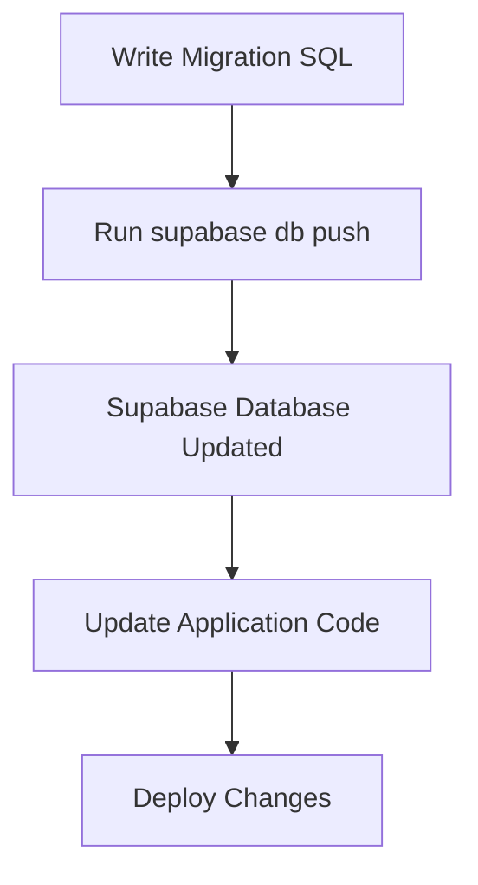

# Database Migrations for iite.bet (IBT)

**Version:** 0.1.0  
**Author:** Jeremiah Pegues <word@iite.bet>  
**Date:** 2024-06-01

---

## Overview

This document describes the database migration process for iite.bet using Supabase.

---

## Migration Files

- Migration SQL files are stored in the `supabase/migrations/` directory.
- Each migration file is timestamped and contains SQL statements to modify the database schema.

---

## Running Migrations

Use the Supabase CLI to apply migrations:

```bash
supabase db push
```

This command applies all unapplied migrations to the Supabase database.

---

## Migration Workflow



---

## Best Practices

- Always test migrations in a development environment before applying to production.
- Use version control to track migration files.
- Write reversible migrations when possible.
- Document schema changes in `docs/database-schema.md`.

---

## Author

Jeremiah Pegues <word@iite.bet>
