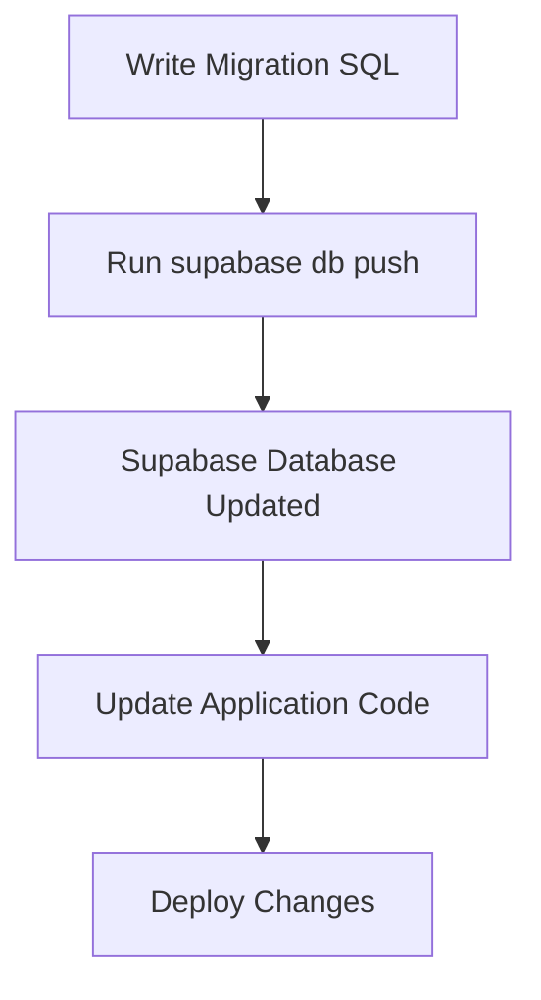

# Development Setup for iite.bet (IBT)

**Version:** 0.1.0  
**Author:** Jeremiah Pegues <word@iite.bet>  
**Date:** 2024-06-01

---

## Overview

This document describes the development environment setup for iite.bet, including Supabase integration, environment variables, and migration workflow.

---

## Supabase Setup

1. Create a Supabase project at [https://supabase.com](https://supabase.com).

2. Obtain the following credentials from the Supabase dashboard:

   - `SUPABASE_URL`
   - `SUPABASE_ANON_KEY`
   - `SUPABASE_SERVICE_ROLE_KEY` (for server-side operations)

3. Add these to your local `.env.local` file:

   ```env
   NEXT_PUBLIC_SUPABASE_URL=your_supabase_url
   NEXT_PUBLIC_SUPABASE_ANON_KEY=your_supabase_anon_key
   SUPABASE_SERVICE_ROLE_KEY=your_service_role_key
   ```

---

## Environment Variables

- `NEXT_PUBLIC_SUPABASE_URL` and `NEXT_PUBLIC_SUPABASE_ANON_KEY` are exposed to the frontend.
- `SUPABASE_SERVICE_ROLE_KEY` should be kept secret and used only in server-side code.

---

## Migration Workflow

We use Supabase CLI or SQL migration files to manage database schema changes.



---

## Running Locally

- Install dependencies:

  ```bash
  npm install
  ```

- Run development server:

  ```bash
  npm run dev
  ```

- Ensure `.env.local` is configured with Supabase credentials.

---

## Version Control

- Use Git with semantic versioning.
- Commit messages follow Conventional Commits.
- Branching strategy: feature branches, main branch for stable releases.

---

## Author

Jeremiah Pegues <word@iite.bet>
